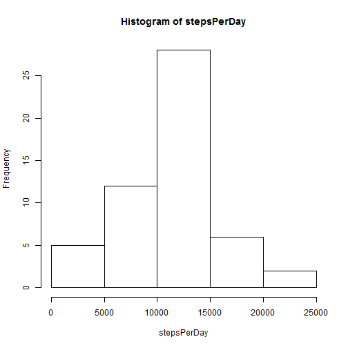
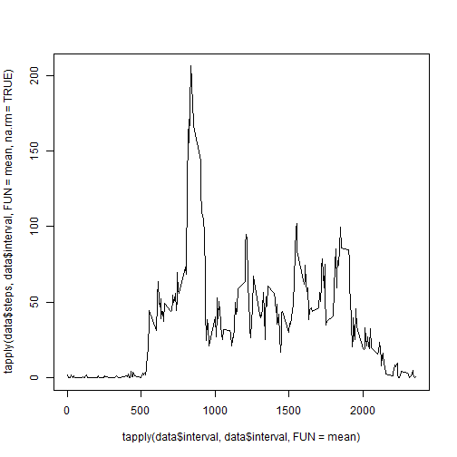
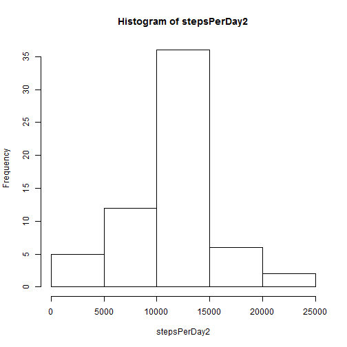
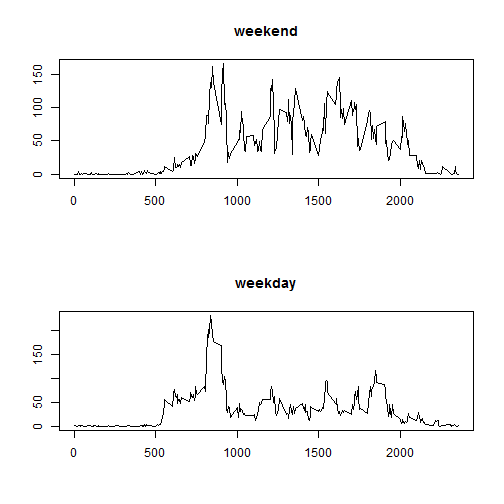

## Loading and preprocessing the data
Show any code that is needed to  
   1. Load the data (i.e. read.csv())  
   2. Process/transform the data (if necessary) into a format suitable for your analysis


```r
data <- read.csv(unz("activity.zip", "activity.csv"))
```


## What is mean total number of steps taken per day?
For this part of the assignment, you can ignore the missing values in 
the dataset.  
  1.  Calculate the total number of steps taken per day  
  2.  Make a histogram of the total number of steps taken each day  
  3. Calculate and report the mean and median of the total number of steps 
  taken per day


```r
stepsPerDay <- tapply(data$steps, data$date, FUN=sum)
hist(stepsPerDay)
```

 

```r
cat("Mean steps per day: ",mean(stepsPerDay,na.rm=TRUE), "\n")
```

```
## Mean steps per day:  10766.19
```

```r
cat("Median steps per day: ", median(stepsPerDay,na.rm=TRUE), "\n")
```

```
## Median steps per day:  10765
```


## What is the average daily activity pattern?
   1. Make a time series plot (i.e. type = "l") of the 5-minute interval 
   (x-axis) and the average number of steps taken, averaged across 
   all days (y-axis)
   2. Which 5-minute interval, on average across all the days in the dataset, 
   contains the maximum number of steps?


```r
plot(tapply(data$interval, data$interval, FUN=mean),
     tapply(data$steps, data$interval, FUN=mean, na.rm=TRUE), type="l")
```

 

```r
avgStepsPerInterval <- cbind(tapply(data$interval, data$interval, FUN=mean),
                             tapply(data$steps, data$interval, FUN=mean, 
                                    na.rm=TRUE))
values <- avgStepsPerInterval[avgStepsPerInterval[,2] == 
                                  max(avgStepsPerInterval[,2])]
cat("5-minute interval containing the maximum number of steps: interval ", 
    values[1])
```

```
## 5-minute interval containing the maximum number of steps: interval  835
```


## Imputing missing values
Note that there are a number of days/intervals where there are missing values 
(coded as NA). The presence of missing days may introduce bias into some 
calculations or summaries of the data.  

   1. Calculate and report the total number of missing values in the dataset 
    (i.e. the total number of rows with NAs)  
   2. Devise a strategy for filling in all of the missing values in the 
    dataset. The strategy does not need to be sophisticated. For example, 
    you could use the mean/median for that day, or the mean for that 
    5-minute interval, etc.  
   3. Create a new dataset that is equal to the original dataset but with 
    the missing data filled in.  
   4. Make a histogram of the total number of steps taken each day and 
    Calculate and report the mean and median total number of steps taken 
    per day. Do these values differ from the estimates from the first part 
    of the assignment? What is the impact of imputing missing data on the 
    estimates of the total daily number of steps?  


```r
cat("Total number of missing values in the dataset: ", sum(is.na(data)))
```

```
## Total number of missing values in the dataset:  2304
```

```r
intervalMeanSteps <- tapply(data$steps, data$interval, FUN=mean, na.rm=TRUE)
data2 <- data
for (nullVal in c(which(is.na(data$steps))))
    {
    data2[nullVal,1] <- 
        as.integer(intervalMeanSteps[as.character(data2[nullVal,3])])
    }
stepsPerDay2 <- tapply(data2$steps, data2$date, FUN=sum)
hist(stepsPerDay2)
```

 

```r
cat("Mean steps per day(with missing values filled): ",
    mean(stepsPerDay2,na.rm=TRUE), "\n")
```

```
## Mean steps per day(with missing values filled):  10749.77
```

```r
cat("Median steps per day (with missing values filled): ", 
    median(stepsPerDay2,na.rm=TRUE), "\n")
```

```
## Median steps per day (with missing values filled):  10641
```


## Are there differences in activity patterns between weekdays and weekends?
For this part the weekdays() function may be of some help here. 
Use the dataset with the filled-in missing values for this part. 

   1. Create a new factor variable in the dataset with two levels - 
   "weekday" and "weekend" indicating whether a given date is a weekday or weekend day.
   2. Make a panel plot containing a time series plot (i.e. type = "l") of 
   the 5-minute interval (x-axis) and the average number of steps taken, 
   averaged across all weekday days or weekend days (y-axis). 
   See the README file in the GitHub repository to see an example of 
   what this plot should look like using simulated data.
   

```r
data2$weekendOrDay <- "weekday"
data2$weekendOrDay[which(weekdays(as.Date(as.character(data2$date))) 
                      %in% c("Saturday","Sunday"))] <- "weekend"
weekendData <- data2[data2$weekendOrDay == "weekend",]
weekdayData <- data2[data2$weekendOrDay == "weekday",]
weekendIMeanSteps <- 
    tapply(weekendData$steps, weekendData$interval, FUN=mean, na.rm=TRUE)
weekdayIMeanSteps <- 
    tapply(weekdayData$steps, weekdayData$interval, FUN=mean, na.rm=TRUE)
par(mfrow = c(2,1))
plot( as.integer(names(weekendIMeanSteps)),weekendIMeanSteps, type = "l",
         main="weekend",
         xlab = "",
         ylab = "")
plot( as.integer(names(weekdayIMeanSteps)),weekdayIMeanSteps, type = "l",
         main="weekday",
         xlab = "",
         ylab = "")
```

 
